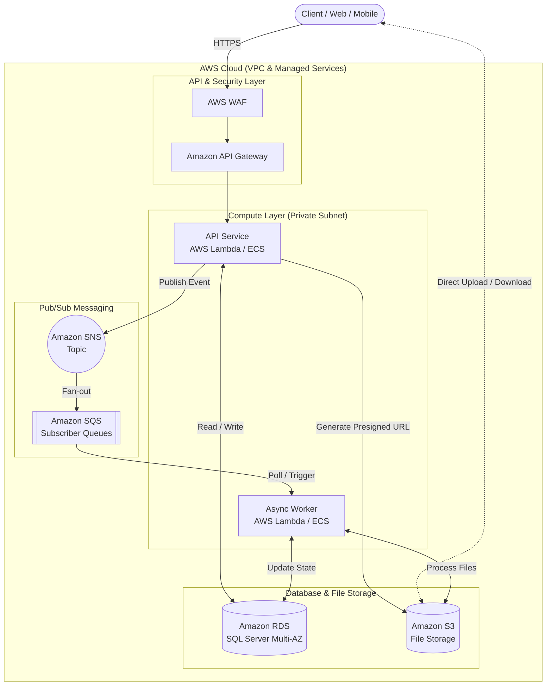

# AWS Architecture

An architectural diagram for AWS showing components used with an API with a sql server database, pub/sub, file storage.

```mermaid
flowchart TD
    Client([Client / Web / Mobile])

    subgraph AWS ["AWS Cloud (VPC & Managed Services)"]
        direction TD

        subgraph Entry ["API & Security Layer"]
            WAF[AWS WAF]
            APIGW[Amazon API Gateway]
        end

        subgraph Compute ["Compute Layer (Private Subnet)"]
            API_Svc["API Service<br/>AWS Lambda / ECS"]
            Worker["Async Worker<br/>AWS Lambda / ECS"]
        end

        subgraph Data ["Database & File Storage"]
            RDS[("Amazon RDS<br/>SQL Server Multi-AZ")]
            S3[("Amazon S3<br/>File Storage")]
        end

        subgraph PubSub ["Pub/Sub Messaging"]
            SNS(("Amazon SNS<br/>Topic"))
            SQS[["Amazon SQS<br/>Subscriber Queues"]]
        end
    end

    %% Request & Auth Flow
    Client -->|HTTPS| WAF
    WAF --> APIGW
    APIGW --> API_Svc

    %% Data & Storage Operations
    API_Svc <-->|Read / Write| RDS
    API_Svc -->|Generate Presigned URL| S3
    Client <-.->|Direct Upload / Download| S3

    %% Pub/Sub Event Flow
    API_Svc -->|Publish Event| SNS
    SNS -->|Fan-out| SQS
    SQS -->|Poll / Trigger| Worker
    Worker <-->|Update State| RDS
    Worker <-->|Process Files| S3
```
