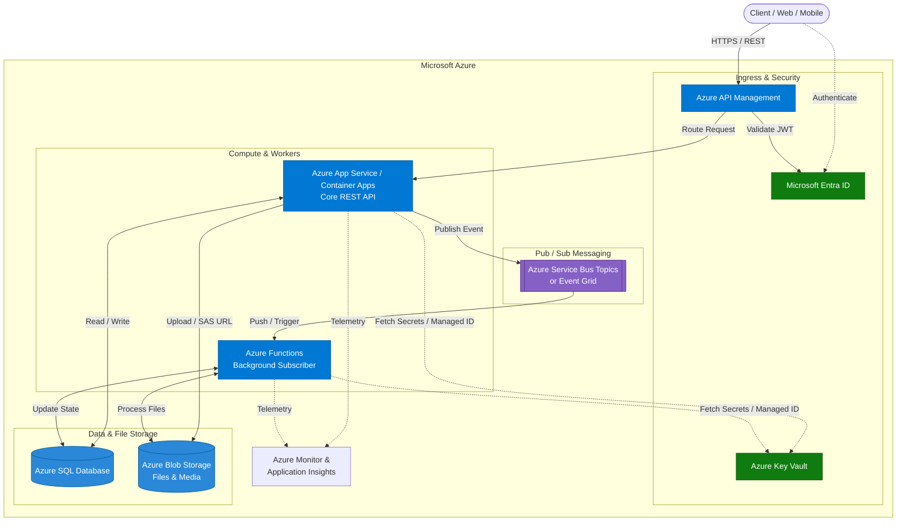

# Azure Architecture

An architectural diagram for Azure showing components used with an API with a sql server database, pub/sub, file storage.

```mermaid
flowchart TD
    %% External Clients
    Client([Client / Web / Mobile])

    subgraph Azure ["Microsoft Azure"]
        direction TD

        %% Ingress & Security
        subgraph Edge ["Ingress & Security"]
            APIM[Azure API Management]
            Entra[Microsoft Entra ID]
            KV[Azure Key Vault]
        end

        %% Compute Layer
        subgraph Compute ["Compute & Workers"]
            API[Azure App Service / Container Apps<br/>Core REST API]
            Worker[Azure Functions<br/>Background Subscriber]
        end

        %% Messaging (Pub/Sub)
        subgraph Messaging ["Pub / Sub Messaging"]
            SB[[Azure Service Bus Topics<br/>or Event Grid]]
        end

        %% Data & Storage Layer
        subgraph Data ["Data & File Storage"]
            SQL[(Azure SQL Database)]
            Blob[(Azure Blob Storage<br/>Files & Media)]
        end

        %% Observability
        Monitor[Azure Monitor &<br/>Application Insights]
    end

    %% Client & Auth Flows
    Client -->|HTTPS / REST| APIM
    Client -.->|Authenticate| Entra
    APIM -->|Validate JWT| Entra
    APIM -->|Route Request| API

    %% API Interactions
    API <-->|Read / Write| SQL
    API -->|Upload / SAS URL| Blob
    API -->|Publish Event| SB

    %% Pub/Sub & Background Processing
    SB -->|Push / Trigger| Worker
    Worker <-->|Update State| SQL
    Worker <-->|Process Files| Blob

    %% Security & Monitoring
    API -.->|Fetch Secrets / Managed ID| KV
    Worker -.->|Fetch Secrets / Managed ID| KV
    API -.->|Telemetry| Monitor
    Worker -.->|Telemetry| Monitor

    %% Styling
    classDef azure fill:#0078D4,stroke:#005A9E,color:#fff;
    classDef storage fill:#2B88D8,stroke:#005A9E,color:#fff;
    classDef messaging fill:#8661C5,stroke:#5C2D91,color:#fff;
    classDef security fill:#107C10,stroke:#0B5A0B,color:#fff;

    class APIM,API,Worker azure;
    class SQL,Blob storage;
    class SB messaging;
    class Entra,KV security;
```
