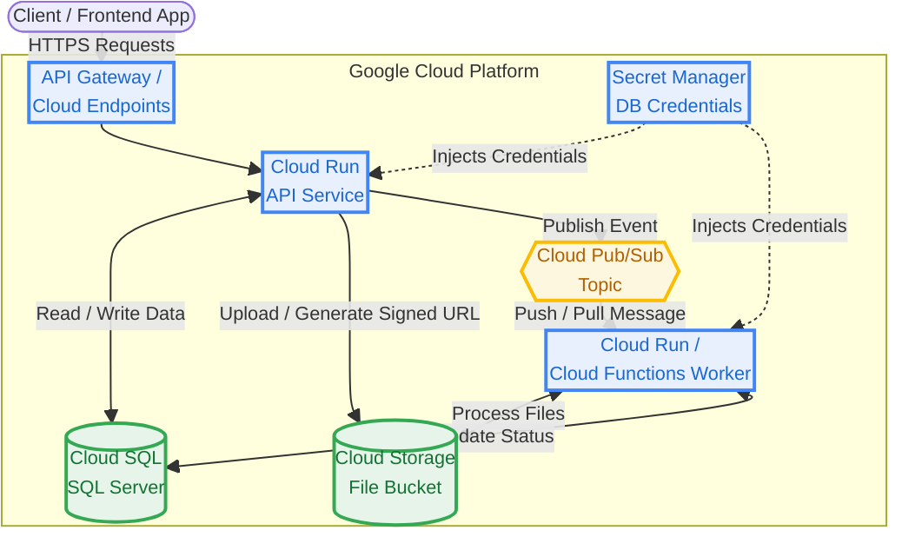

# GCP Architecture

An architectural diagram for GCP showing components used with an API with a sql server database, pub/sub, file storage.

```mermaid
%%{init: {"themeVariables": {"fontSize": "11px"}, "flowchart": {"useMaxWidth": true, "nodeSpacing": 1, "rankSpacing": 1, "padding": 1, "diagramPadding": 1, "subGraphTitleMargin": {"top": 2, "bottom": 2}}}}%%
flowchart TD
    %% External Actors
    Client([Client / Frontend App])

    %% GCP Boundary
    subgraph GCP [Google Cloud Platform]
        direction TD

        %% Ingress & API
        APIGW[API Gateway /<br/>Cloud Endpoints]
        API[Cloud Run<br/>API Service]

        %% Storage & Data
        SQL[(Cloud SQL<br/>SQL Server)]
        GCS[(Cloud Storage<br/>File Bucket)]

        %% Messaging & Workers
        PubSub{{Cloud Pub/Sub<br/>Topic}}
        Worker[Cloud Run /<br/>Cloud Functions Worker]
        
        %% Security
        Secrets[Secret Manager<br/>DB Credentials]
    end

    %% Connections
    Client -->|HTTPS Requests| APIGW
    APIGW --> API
    
    %% Synchronous Operations
    API <-->|Read / Write Data| SQL
    API -->|Upload / Generate Signed URL| GCS
    Secrets -.->|Injects Credentials| API
    Secrets -.->|Injects Credentials| Worker

    %% Asynchronous Operations
    API -->|Publish Event| PubSub
    PubSub -->|Push / Pull Message| Worker
    Worker <-->|Process Files| GCS
    Worker <-->|Update Status| SQL

    %% Styling
    classDef gcp fill:#e8f0fe,stroke:#4285f4,stroke-width:2px,color:#1967d2;
    classDef storage fill:#e6f4ea,stroke:#34a853,stroke-width:2px,color:#137333;
    classDef messaging fill:#fef7e0,stroke:#fbbc04,stroke-width:2px,color:#b06000;
    
    class APIGW,API,Worker,Secrets gcp;
    class SQL,GCS storage;
    class PubSub messaging;
```
