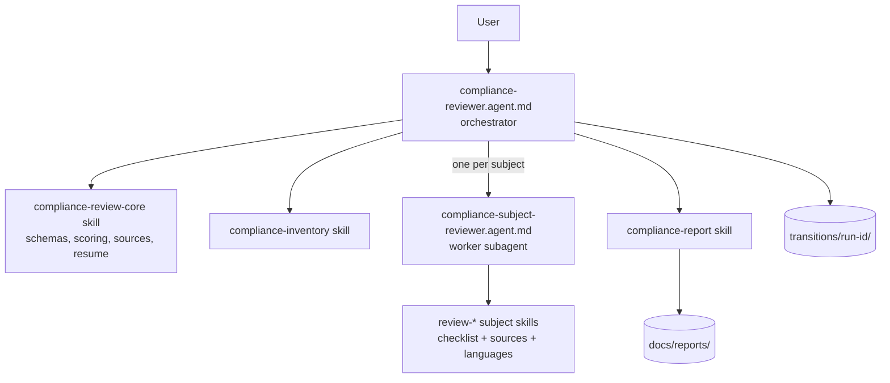

# Compliance Reviewer

A VS Code GitHub Copilot orchestrator agent that reviews a codebase you point it at — architecture, coding standards, security, testing, operations and more — and produces a single scored Markdown report. It never modifies the code it reviews.

## Purpose and Structure

The orchestrator (`compliance-reviewer`) breaks the review into one subject at a time (e.g. Security — Identity & Access, API Design, Testing). For each subject it delegates to a hidden worker subagent (`compliance-subject-reviewer`), which loads exactly one `review-*` skill, reads only the files relevant to that subject, and returns findings as JSON. The orchestrator writes every step's output to a transition file so an interrupted run can be resumed, then aggregates everything into a scored report.

### Files

| Path | Role |
|------|------|
| `.github/agents/compliance-reviewer.agent.md` | Orchestrator agent (user-invocable) |
| `.github/agents/compliance-subject-reviewer.agent.md` | Worker subagent (hidden) |
| `.github/skills/compliance-review-core/` | Shared schemas, scoring rubric, source allowlist, resume rules |
| `.github/skills/compliance-inventory/` | Repo mapping and file-list batching |
| `.github/skills/review-*/` | One skill per subject (18 total): checklist, sources, optional per-language files |
| `.github/skills/compliance-report/` | Aggregation and report rendering, including the report template |
| `transitions/<run-id>/` | Per-run transition files and `state.json` (resumable) |
| `docs/reports/` | Final scored Markdown reports |

## Usage

1. Open chat and invoke the `compliance-reviewer` agent (or `@compliance-reviewer`, depending on your Copilot version).
2. Give it the path to the codebase to review — this can be outside the current workspace. The target is always read-only.
3. Optionally name which subjects to review (default: all 18). See the subject table in [`docs/compliance-review-agent-plan.md`](../compliance-review-agent-plan.md). Disaster Recovery, Monitoring and Cost & Sustainability are automatically marked N/A (no subagent invoked) when the target has no infrastructure-as-code.
4. If you want CLI analyzers run (`dotnet list package --vulnerable`, `mvn dependency:tree`, `pip-audit`, configured linters), approve them when asked. Otherwise the agent reviews by reading files only.
5. If the agent needs to fetch a URL that isn't on the pre-approved allowlist (`.github/skills/compliance-review-core/references/approved-sources.md`), it will ask before fetching.
6. Watch the todo list and status line update after each step; the final message links to the report under `docs/reports/`.

## Resuming After an Interruption

- On startup, the agent lists unfinished runs under `transitions/` and offers to resume the most recent one.
- `resume run <id>` — continues from the first step that isn't `completed`.
- `resume run <id> from step <NN>` — moves transition files for step `NN` onward into `transitions/<id>/superseded/`, then re-runs those steps.
  - Example: `resume run 2026-09-26_1420-myapp from step 12` re-runs from the security subjects onward if step 12 was `review-security-input-injection`.
- If the target's git HEAD or inputs have changed since the run started, the agent warns you and asks whether to continue, restart, or abort.

## Maintenance Best Practices

- Review each skill's checklist against its cited sources on a regular schedule, and keep URL anchors current.
- **To add a subject:** create a `.github/skills/review-<name>/` folder with `SKILL.md`, `references/checklist.md` and `references/sources.md`, then add it to the subject table in the plan and to `approved-sources.md`.
- **To add a language:** add a `references/languages/<id>.md` file to each skill that needs it, and add the detection signal to `compliance-review-core`'s `references/languages.md`.
- **Before adding a subject or check, look for overlap with existing skills first** (e.g. layering/coupling concerns live in `review-software-quality`'s Architecture Patterns sub-subject; resilience patterns visible from IaC alone live in the IaC-gated Operations skills). Duplicate checks across skills waste a subagent pass and, even with the cross-subject dedup pass in `compliance-report`, add noise to per-subject `checkResults`.
- **IaC-gated subjects** (`review-disaster-recovery`, `review-monitoring`, `review-cost-sustainability`) are skipped entirely — no subagent call — when `compliance-inventory` reports `iacFound: false`. If you add a new subject that depends entirely on infrastructure-as-code, gate it the same way instead of running it against an empty file list.
- Version the schemas (`finding-schema.md`, `transition-schema.md`) — bump `schemaVersion` on breaking changes and note the change.
- Keep each `SKILL.md` short; put detail in `references/`.
- Test changes against a small sample repo (e.g. a small ASP.NET, Spring or FastAPI project) before relying on them for a real review.
