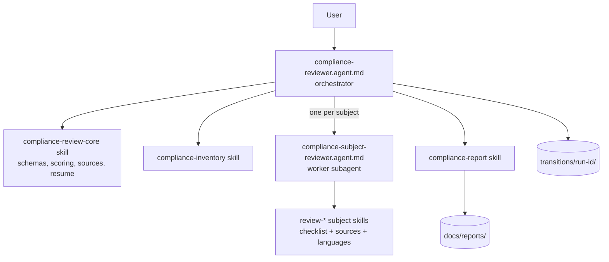

# Plan: Compliance Review Agent (Architecture, Coding, Security)

## Summary

A VS Code GitHub Copilot orchestrator agent that reviews a codebase at a path you supply. For each subject it hands the work to a subagent that uses one skill and reads only the files it needs. Every step saves its results to `transitions/<run-id>/` so an interrupted run can be resumed. At the end the agent writes a scored report to `docs/reports/`.

Each skill ships a short checklist, so reference URLs are fetched only when the agent needs more detail or a citation. The approved URLs live in one allowlist; any other URL needs your approval before it is fetched.

## Decisions

| Topic | Decision |
|-------|----------|
| Platform | VS Code Copilot custom agent (`.github/agents/*.agent.md`) and skills (`.github/skills/<name>/SKILL.md`) |
| Target source | Path supplied by the user; may be outside this repo. The target is **read-only**. |
| Output location | In this repo. Reports go to `docs/reports/`; transition files go to `transitions/<run-id>/`. |
| Unlisted subjects | The plan proposes authoritative pre-approved sources (see [Pre-approved Sources](#pre-approved-sources)) for user review. |
| Severity | Wording in the source decides severity: DO / MUST / REQUIRED = **Error**, SHOULD = **Warning**, MAY = **Information**. Sources without such wording use a fallback rubric per skill. |
| Scoring | A score from 0 to 100 for each subject, plus an overall score, each with a rating band. |
| Language-specific guidance | C#/.NET, Java, Python. Other languages use the generic core. |
| External analyzers | The agent reads files only by default. It runs installed CLI analyzers only after the user approves them for that run. |
| Out of scope | Fixing the target code, CI integration, dynamic security testing (DAST). |

## Link Access Policy

- The agent may fetch any URL in `approved-sources.md` without asking. This covers the agent itself, the worker subagent and every skill.
- For any other URL, the agent **must ask the user first**, using the ask-questions tool. The answer (approved or denied) is recorded in `state.json`.
- Each skill includes a short checklist, so fetching is only needed for detail or for a precise citation anchor. This keeps the context small.

## Architecture

## Steps

### Phase A: Plan and shared core

1. Write this plan to `docs/compliance-review-agent-plan.md`.
2. Create the shared core skill `.github/skills/compliance-review-core/`. Its `references/` folder holds:
   - **`approved-sources.md`**
     - The pre-approved URL allowlist, grouped by subject.
     - It contains every link the user supplied plus the proposed sources.
     - It restates the Link Access Policy.
   - **`severity-and-scoring.md`**
     - Wording-to-severity mapping:
       - DO / MUST / REQUIRED → Error
       - SHOULD / YOU SHOULD → Warning
       - MAY / YOU MAY → Information
     - For the Microsoft Azure API Guidelines, the mapping is explicit:
       - `DO` items are required and are Errors if not implemented.
       - `YOU SHOULD` items are Warnings if not implemented.
       - `YOU MAY` items are Information if not implemented.
     - Fallback rubric for sources without such wording:
       - An exploitable security flaw or a risk of data loss → Error
       - A gap against best practice → Warning
       - A stylistic or optional point → Information
     - Scoring: score = weighted checks passed ÷ weighted checks that apply. Weights are Error 5, Warning 2, Information 1. Checks that don't apply (N/A) are left out.
     - Bands: 90+ Excellent, 75–89 Good, 60–74 Fair, below 60 Poor.
   - **`finding-schema.md`**
     - One JSON shape for findings. Fields: id, subject, sub-subject, check id, severity, title, evidence (file, line range, short excerpt), standard name, URL with anchor, recommendation, confidence, effort.
     - Also defines shapes for strengths and for check results (pass / fail / N/A).
   - **`transition-schema.md`**
     - How transition files are named.
     - Required header fields: `schemaVersion`, `runId`, `stepId`, `status`, `startedAt`, `completedAt`, `targetPath`, `targetGitHead` (when the target is a git repo), `inputsHash`.
     - Layout of `state.json` and the resume rules.
   - **`languages.md`**
     - How each language is detected from file extensions and build files:

       | Language | Signals |
       |----------|---------|
       | C#/.NET | `*.csproj`, `*.sln` |
       | Java | `pom.xml`, `build.gradle` |
       | Python | `pyproject.toml`, `requirements.txt` |

     - Language ids: `csharp`, `java`, `python`, `generic`.
     - Convention for every skill: always load `references/checklist.md`. Also load `references/languages/<id>.md`, but only when inventory found that language.
   - **`status-format.md`**
     - The todo list has one item per pipeline step.
     - After each step the agent posts one status line:
       `Step N/T: <name> done. Next: <name>. Remaining: <list>`
     - The status line also shows running totals of findings by severity.

### Phase B: Agents (depends on step 2)

3. **Orchestrator**: `.github/agents/compliance-reviewer.agent.md`.
   - Tools: read, search, edit, agent (subagents), todo, web fetch, ask-questions, execute.
   - Edit is limited to `transitions/` and `docs/reports/`.
   - Execute is used only for analyzers the user has approved.
   - The body states:
     - The target source is never modified.
     - The Link Access Policy applies.
     - Pipeline order, resume behavior and status reporting follow the core skill.
4. **Worker**: `.github/agents/compliance-subject-reviewer.agent.md`.
   - Hidden from users (`user-invocable: false`).
   - Tools: read, search, web fetch.
   - Input: skill name, run id, list of files in scope, detected languages, and a batch index when the subject is split into batches.
   - Output: JSON only, containing findings, strengths and check results. The orchestrator writes the transition file.

### Phase C: Inventory and analyzers (depends on step 2; can run alongside Phase B)

5. **`.github/skills/compliance-inventory/`**
   - Builds a map of the repo:
     - languages, frameworks and entry points
     - API specs (`openapi.*`, `swagger.*`) and controllers
     - infrastructure-as-code, Dockerfiles, CI/CD files, test folders, dependency manifests and config files
   - Produces, for each subject, the list of files in scope, split into batches for large repos.
6. **Optional analyzer step** (documented in the inventory skill).
   - Detects which analyzers are installed, for example `dotnet list package --vulnerable`, `mvn dependency:tree`, `pip-audit`, and linters.
   - Runs them only after the user approves them for the run.
   - Saves the output to `02-analyzers.json` for the dependency and coding skills to use.

### Phase D: Subject skills (depends on step 2; the skills can be built in parallel)

Every skill folder `.github/skills/review-*/` contains:

- `SKILL.md`: a "Use when…" description, the inputs, the procedure and the output format.
- `references/checklist.md`: short checks, each with an id, a default severity and a source URL with an anchor.
- `references/sources.md`: the part of the allowlist that the skill uses.
- `references/languages/{csharp,java,python}.md`: optional; loaded only when that language is detected.

| # | Subject | Skill(s) | Focus |
|---|---------|----------|-------|
| 7 | Software Quality | `review-software-quality` | ISO/IEC 25010 characteristics, complexity, duplication, code smells; also design pattern usage/misuse and architecture layering/coupling/cloud-pattern fit (merged from the former `review-design-patterns` and `review-architecture-patterns` skills to cut redundant passes over the same files and duplicate god-object/coupling findings) |
| 8 | Software Lifecycle | `review-software-lifecycle` | CI/CD, branching, versioning (SemVer), release process, NIST SSDF / SLSA supply chain, documentation |
| 9 | Application Design | `review-twelve-factor` | One check per factor, each linked to its page on 12factor.net |
| 10 | API Design | `review-api-design` | The OpenAPI spec exists, is valid and matches the implementation. Microsoft Azure API Guidelines, with severity taken from the DO / YOU SHOULD / YOU MAY wording. Marked N/A if no API is found. |
| 11 | Security | `review-security-identity-access` | Authentication, Authorization, OAuth 2.0, JWT, Session Management, Password Storage, Zero Trust |
| | | `review-security-input-injection` | Input Validation, Injection Prevention, SQL Injection Prevention, Query Parameterization, XML Security, File Upload |
| | | `review-security-web-api` | Content Security Policy, HTTP Security Response Headers, REST Security |
| | | `review-security-operational` | Error Handling, Logging, Secrets Management; the Secure Code Review sheet is used as the review method |
| 12 | Implementation | `review-coding-standards` | Generic core plus the C#, Java and Python language files |
| | | `review-testing` | Test pyramid, coverage signals, test quality |
| | | `review-observability` | Structured logging, tracing and metrics in code; OpenTelemetry; also health check endpoints and SLO/SLI documentation (folded in from `review-monitoring`, since these are source/doc-visible rather than IaC-only) |
| | | `review-dependency-management` | Version pinning, lock files, known vulnerabilities, end-of-life versions, licenses, SBOM |
| 13 | Operations | `review-reliability` | Retries, timeouts, circuit breakers, redundancy |
| | | `review-performance` | Caching, async I/O, resource efficiency |
| | | `review-disaster-recovery` | Backup, restore, RPO/RTO, multi-region. **IaC-gated**: marked N/A without a subagent call when `01-inventory.json`'s `iacFound` is false |
| | | `review-monitoring` | Alerting rules, dashboards as code. **IaC-gated**: marked N/A without a subagent call when `iacFound` is false |
| | | `review-cost-sustainability` | Right-sizing, scaling, green software principles. **IaC-gated**: marked N/A without a subagent call when `iacFound` is false |
| | | `review-maintainability` | Modularity, readability, documentation, technical debt |

Security language files:

- `csharp.md` maps to the OWASP DotNet Security Cheat Sheet.
- `java.md` maps to the OWASP Java Security Cheat Sheet.
- `python.md` contains general Python guidance, because OWASP has no Python-specific cheat sheet.

### Phase E: Report (depends on step 2)

14. **`.github/skills/compliance-report/`**
    - **Aggregate:** merge the transition files and collapse duplicates into one finding with several evidence locations. Then compute the scores.
    - **Render:** fill `assets/report-template.md` and write the result to `docs/reports/<target-name>-compliance-review-<YYYY-MM-DD_HHmm>.md`.
    - **Report sections:**
      1. **Summary**: overall score and band, a table of scores by subject, counts by severity, and the top 5 risks.
      2. **Things Done Well**
      3. **Recommended Improvements**, grouped as Errors, then Warnings, then Information. Each item links to its standard or guideline where possible.
      4. **Full Results**: every check in each subject (pass / fail / N/A) with its evidence.
      5. **Appendix**: run metadata, subjects that were skipped, URLs fetched, and link approvals.

### Phase F: Pipeline, resume and README (depends on steps 3–14)

15. **Pipeline steps.** Each step writes one transition file and updates `state.json`.

    | Step | File | Purpose |
    |------|------|---------|
    | 00 | `00-init.json` | Inputs, run id, chosen subjects, analyzer approval |
    | 01 | `01-inventory.json` | Repo map and the file list for each subject |
    | 02 | `02-analyzers.json` | Optional analyzer output |
    | 10–29 | `NN-<skill>.json` | One per subject skill. Large subjects also write `NN-<skill>.part-K.json`, one per batch, so they can resume partway through. |
    | 90 | `90-aggregate.json` | Merged findings and scores |
    | 99 | `99-report.json` | Path to the report and completion status |

16. **Resume protocol**
    - When it starts, the agent lists runs in `transitions/` that haven't finished and offers to resume one.
    - The user can also ask directly:
      - `resume run <id>`: continue from the first step that isn't finished.
      - `resume run <id> from step <NN>`: move the transition files from step `NN` onward into `superseded/`, then run those steps again.
    - If the target's git HEAD or inputs hash has changed since the run started, the agent warns the user and asks whether to continue.
17. **README** at `docs/compliance-reviewer/README.md`. It covers:
    - **Purpose and structure:** what the agent does, plus a diagram of the agent, the worker, the skills and their references.
    - **Usage:** how to invoke the agent, the inputs, choosing subjects, approving analyzers, and where outputs are written.
    - **Resuming after an interruption:** how to resume at a specific step, with examples.
    - **Maintenance best practices:**
      - Review each checklist against its sources on a regular schedule, and keep the URL anchors current.
      - To add a subject: create a skill folder with a checklist, then register it in the pipeline and in the allowlist.
      - To add a language: add a `languages/<id>.md` file to each skill and an entry to `languages.md`.
      - Version the schemas.
      - Keep `SKILL.md` files short and move detail into the reference files.
      - Test changes against a small sample repo.
18. Add a one-line pointer to the agent and its README in `.github/copilot-instructions.md`. Add `transitions/` to `.gitignore`.

## Relevant Files

All files are new unless marked otherwise.

- `docs/compliance-review-agent-plan.md`
- `.github/agents/compliance-reviewer.agent.md`
- `.github/agents/compliance-subject-reviewer.agent.md`
- `.github/skills/compliance-review-core/references/*`
- `.github/skills/compliance-inventory/`
- `.github/skills/compliance-report/`, including `assets/report-template.md`
- 18 subject skill folders under `.github/skills/review-*/`
- `docs/compliance-reviewer/README.md`
- `.github/copilot-instructions.md` (edit)

## Pre-approved Sources

### Supplied by the user

**API Design**

- https://spec.openapis.org/oas/latest.html
- https://github.com/microsoft/api-guidelines/blob/vNext/azure/Guidelines.md

**Coding Standards**

- .NET: https://learn.microsoft.com/dotnet/csharp/fundamentals/coding-style/coding-conventions; 
- Java: https://google.github.io/styleguide/javaguide.html; 
- Python: https://peps.python.org/pep-0008/ |

**Observability**

- https://opentelemetry.io/docs/ |

**OWASP Top 10**

- https://owasp.org/Top10/

**OWASP Cheat Sheets**

- https://cheatsheetseries.owasp.org/cheatsheets/Authentication_Cheat_Sheet.html
- https://cheatsheetseries.owasp.org/cheatsheets/Authorization_Cheat_Sheet.html
- https://cheatsheetseries.owasp.org/cheatsheets/Content_Security_Policy_Cheat_Sheet.html
- https://cheatsheetseries.owasp.org/cheatsheets/DotNet_Security_Cheat_Sheet.html
- https://cheatsheetseries.owasp.org/cheatsheets/Error_Handling_Cheat_Sheet.html
- https://cheatsheetseries.owasp.org/cheatsheets/File_Upload_Cheat_Sheet.html
- https://cheatsheetseries.owasp.org/cheatsheets/HTTP_Headers_Cheat_Sheet.html
- https://cheatsheetseries.owasp.org/cheatsheets/Injection_Prevention_Cheat_Sheet.html
- https://cheatsheetseries.owasp.org/cheatsheets/Input_Validation_Cheat_Sheet.html
- https://cheatsheetseries.owasp.org/cheatsheets/JSON_Web_Token_Cheat_Sheet.html
- https://cheatsheetseries.owasp.org/cheatsheets/Java_Security_Cheat_Sheet.html
- https://cheatsheetseries.owasp.org/cheatsheets/Logging_Cheat_Sheet.html
- https://cheatsheetseries.owasp.org/cheatsheets/OAuth2_Cheat_Sheet.html
- https://cheatsheetseries.owasp.org/cheatsheets/Password_Storage_Cheat_Sheet.html
- https://cheatsheetseries.owasp.org/cheatsheets/Query_Parameterization_Cheat_Sheet.html
- https://cheatsheetseries.owasp.org/cheatsheets/REST_Security_Cheat_Sheet.html
- https://cheatsheetseries.owasp.org/cheatsheets/SQL_Injection_Prevention_Cheat_Sheet.html
- https://cheatsheetseries.owasp.org/cheatsheets/Secrets_Management_Cheat_Sheet.html
- https://cheatsheetseries.owasp.org/cheatsheets/Secure_Code_Review_Cheat_Sheet.html
- https://cheatsheetseries.owasp.org/cheatsheets/Session_Management_Cheat_Sheet.html
- https://cheatsheetseries.owasp.org/cheatsheets/XML_Security_Cheat_Sheet.html
- https://cheatsheetseries.owasp.org/cheatsheets/Zero_Trust_Architecture_Cheat_Sheet.html

**Semantic Versioning**

- https://semver.org/

**Software Quality**

- https://iso25000.com/index.php/en/iso-25000-standards/iso-25010

**Testing**

- https://martinfowler.com/articles/practical-test-pyramid.html

**Twelve-Factor App**

- https://12factor.net/

## Verification

1. **Frontmatter:** check the YAML frontmatter of every agent and skill file.
   - `name` matches the folder name.
   - Descriptions that contain colons are quoted.
   - Each description includes "Use when…" trigger words.
2. **Agent picker:** `compliance-reviewer` is listed; the worker agent is not.
3. **Sample run:** run the agent on a small sample repo (for example a small ASP.NET, Spring or FastAPI project). Confirm that:
   - the todo list and status lines update after each step
   - the transition files and `state.json` are written
   - the report file name follows the pattern
   - findings in every severity group link to their sources
4. **Resume:** interrupt a run during step 10 or later, then try `resume run <id>` and `resume run <id> from step 12`. Confirm that only the expected steps run again and that replaced files are moved to `superseded/`.
5. **Link policy:** give the agent a URL that isn't on the allowlist and confirm it asks before fetching.
6. **Read-only target:** after a run, `git status` on the target shows no changes.
7. **N/A handling:** API Design is marked N/A for a repo that has no API; Disaster Recovery, Monitoring and Cost & Sustainability are marked N/A (no subagent invoked) for a repo with no infrastructure-as-code (`iacFound: false` in `01-inventory.json`).
8. **Cross-subject dedup:** seed a repo with one issue that both Software Quality's Architecture Patterns sub-subject and Reliability would flag (e.g. an HTTP call with no timeout and no circuit breaker) and confirm the aggregate step reports it once in `findings`/top-5-risks, while both subjects' `checkResults` still show `fail` with `findingIds` pointing at the same finding id.

## Further Considerations

1. **Enforcing the URL allowlist.** Auto-approving the allowlisted domains at the tool level may depend on a VS Code setting whose name must be confirmed during implementation. The recommended fallback is to enforce the allowlist through the agent's instructions only.

## Q&A

Q: Which agent format should the agent and skills target?
A: VS Code GitHub Copilot custom agent (.github/agents/*.agent.md + .github/skills/*/SKILL.md)

Q: How will the agent locate the application source to review?
A: User supplies a path (any folder, may be outside this repo)

Q: Where should `transitions/` and the final report `docs/` folder live?
A: In this repo: docs/reports/ and transitions/<run-id>/

Q: API guidelines map DO/SHOULD/MAY to Error/Warning/Info. How should severity be determined for other subjects?
A: Map RFC-2119-style wording where present (MUST/DO=Error, SHOULD=Warning, MAY=Info); else rubric per skill (security exploitable=Error, etc.)

Q: Should the report include numeric compliance scores?
A: Yes: per-subject score (0-100) + overall, with rating bands

## Future (**not implenmeted at this time**)

- Cloud design patterns: https://learn.microsoft.com/en-us/azure/architecture/patterns/
- Secure by Design Checklist: https://owasp.org/projects/secure-by-design-framework?tab=checklist
- Design Patterns: https://refactoring.guru/design-patterns
- Dependency Management - OpenSSF Scorecard: https://github.com/ossf/scorecard
