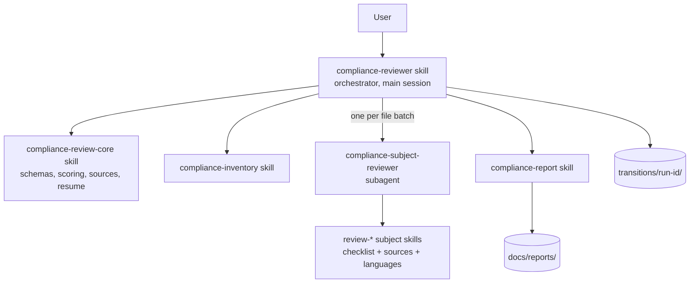

# Compliance Reviewer

A Claude Code skill and subagent set that reviews a codebase you point it at — architecture, coding standards, security, testing, operations and more — and produces a single scored Markdown report. It never modifies the code it reviews.

## Purpose and Structure

The orchestrator skill (`compliance-reviewer`) runs in your main Claude Code session. It inventories the target and gives each subject a small, capped list of concrete files (at most 12). Subjects whose lists mostly overlap are grouped into a batch. For each batch it delegates once to the `compliance-subject-reviewer` subagent, which loads the applicable `review-*` skills, reads the files once, reviews each subject only against that subject's own files, and writes one transition file per subject itself — returning just a short status, so findings never pass back through the orchestrator. A deterministic script (`compliance_report.py`) then validates, aggregates and renders the scored report, so those steps cost no model tokens. Transition files make an interrupted run resumable.

The orchestrator is a skill rather than a subagent because Claude Code subagents cannot start other subagents; running it in the main session lets it delegate to the worker.

### Files

| Path | Role |
|------|------|
| `.claude/skills/compliance-reviewer/` | Orchestrator skill (user-invocable as `/compliance-reviewer`) |
| `.claude/agents/compliance-subject-reviewer.md` | Worker subagent (Read, Grep, Glob, Write, WebFetch) |
| `.claude/skills/compliance-review-core/` | Shared schemas, scoring rubric, source allowlist, resume rules |
| `.claude/skills/compliance-inventory/` | Repo mapping, capped per-subject file lists and batching |
| `.claude/skills/review-*/` | One skill per subject (17 total): checklist, sources, optional per-language files |
| `.claude/skills/compliance-report/` | Validate, aggregate and render (`scripts/compliance_report.py`, needs Python 3), plus the report template |
| `.claude/settings.json` | Pre-approves writes to `transitions/` and `docs/reports/` and running the report script |
| `transitions/<run-id>/` | Per-run transition files and `state.json` (resumable) |
| `docs/reports/` | Final scored Markdown reports |

All supporting skills set `user-invocable: false`, so only `/compliance-reviewer` appears in the slash-command menu.

## Usage

1. Start Claude Code in this repo and run `/compliance-reviewer <path-to-target>` (or just ask Claude to run a compliance review).
2. The target can be outside this workspace and is always read-only. To avoid a read-permission prompt per file, start Claude Code with `--add-dir <path-to-target>` or run `/add-dir <path-to-target>`.
3. Confirm the subjects to review or name a subset when asked; "all" selects all 17 subject skills. The subject list is in [the orchestrator skill](./.claude/skills/compliance-reviewer/SKILL.md). Coding Standards is a sub-subject of Software Quality. Disaster Recovery, Monitoring and Cost & Sustainability are automatically marked N/A (no subagent invoked) when the target has no infrastructure-as-code.
4. If you want CLI analyzers run (`dotnet list package --vulnerable`, `mvn dependency:tree`, `pip-audit`, configured linters), approve them when asked. Otherwise the review reads files only.
5. If a URL isn't on the pre-approved allowlist (`.claude/skills/compliance-review-core/references/approved-sources.md`), Claude asks before fetching it.
6. Watch the todo list and status line update after each step; the final message links to the report under `docs/reports/`.

## Resuming After an Interruption

- On startup, the orchestrator lists unfinished runs under `transitions/` and offers to resume the most recent one.
- `/compliance-reviewer resume run <id>` — continues from the first step that isn't `completed`.
- `/compliance-reviewer resume run <id> from step <NN>` — moves transition files for step `NN` onward into `transitions/<id>/superseded/`, then re-runs those steps.
  - Example: `resume run 2026-09-26_1420-myapp from step 15` re-runs from `review-security-input-injection` onward.
- If the target's git HEAD or inputs have changed since the run started, Claude warns you and asks whether to continue, restart, or abort.

## Maintenance Best Practices

- Review each skill's checklist against its cited sources on a regular schedule, and keep URL anchors current.
- **To add a subject:** create a `.claude/skills/review-<name>/` folder with `SKILL.md` (with `user-invocable: false`), `references/checklist.md` and `references/sources.md`, then add it to the subject table in the orchestrator skill, the step table in `transition-schema.md`, `subject-file-map.md`, and `approved-sources.md`.
- **To add a language:** add a `references/languages/<id>.md` file to each skill that needs it, and add the detection signal to `compliance-review-core`'s `references/languages.md`.
- **Before adding a subject or check, look for overlap with existing skills first** (e.g. layering/coupling concerns live in `review-software-quality`'s Architecture Patterns sub-subject; resilience patterns visible from IaC alone live in the IaC-gated Operations skills). Duplicate checks waste a subagent pass and add noise to per-subject `checkResults`, even with the cross-subject dedup pass in `compliance-report`.
- **IaC-gated subjects** (`review-disaster-recovery`, `review-monitoring`, `review-cost-sustainability`) are skipped entirely — no subagent call — when `compliance-inventory` reports `iacFound: false`. Gate any new IaC-only subject the same way.
- Version the schemas (`finding-schema.md`, `transition-schema.md`) — bump `schemaVersion` on breaking changes and note the change.
- Keep each `SKILL.md` short; put detail in `references/`.
- **Cost levers** (cost scales with tokens read and written): `maxFilesPerSubject` and the batching rules in `compliance-inventory`; the output size caps in `finding-schema.md`; workers writing their own files; the deterministic report script. Check these before adding anything that widens a subject's file list or makes the orchestrator re-emit worker output.
- Test changes against a small sample repo (e.g. a small ASP.NET, Spring or FastAPI project) before relying on them for a real review.
