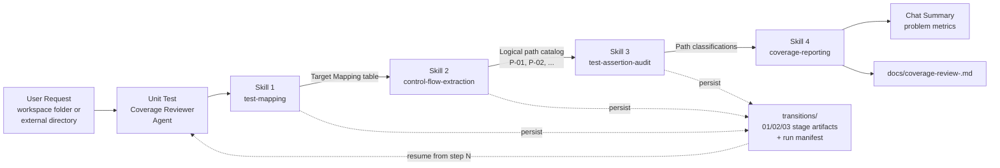

# Unit Test Coverage Reviewer

A custom VS Code agent backed by four modular skills that performs **static logical path & branch coverage audits** — determining whether your unit tests truly exercise every execution path of your source code, without running or modifying a single line of it.

## Architecture Overview

The agent orchestrates a four-stage pipeline. Each stage is a self-contained skill whose structured output feeds the next:



| Component | File | Role |
|-----------|------|------|
| Orchestrating agent | [.github/agents/unit-test-coverage-reviewer.agent.md](.github/agents/unit-test-coverage-reviewer.agent.md) | Coordinates the lifecycle, resolves scope, sequences skills, delivers findings |
| Skill 1 | [.github/skills/unit-test-coverage-test-mapping/SKILL.md](.github/skills/unit-test-coverage-test-mapping/SKILL.md) | Source-to-test discovery & Target Mapping table |
| Skill 2 | [.github/skills/unit-test-coverage-control-flow-extraction/SKILL.md](.github/skills/unit-test-coverage-control-flow-extraction/SKILL.md) | Control flow, branch & edge-case extraction with `P-XX` path IDs |
| Skill 3 | [.github/skills/unit-test-coverage-test-assertion-audit/SKILL.md](.github/skills/unit-test-coverage-test-assertion-audit/SKILL.md) | Test scenario & assertion depth verification per path |
| Skill 4 | [.github/skills/unit-test-coverage-reporting/SKILL.md](.github/skills/unit-test-coverage-reporting/SKILL.md) | Metrics, chat summary & persistent timestamped report |

## Usage

### Invoking the Agent

1. Open the Chat view in VS Code.
2. Select **Unit Test Coverage Reviewer** from the agent picker (the agent is user-invocable).
3. Manually, select a `Claude Sonnet' or 'GPT Codex' model.  This is recommended because the model specification in the agent file is not always honored and a lightweight model may be selected for you, wasting time and credits.
4. Describe the scope, e.g.:
   - *"Review the unit test coverage of `src/services`"*
   - *"Audit logical path coverage for `C:/Working/OtherProject/src`"*

If the scope is ambiguous, the agent asks whether to analyze a workspace subfolder or an external directory before scanning.

### In-Workspace vs External Directory Targeting

| Target | How to specify | Behavior |
|--------|----------------|----------|
| Workspace subfolder | Relative path or name (`src/services`) | Resolved against the workspace root |
| External directory | Absolute path (`C:/Working/OtherProject` or `/path/to/repo`) | Inspected strictly with read/search tools; never written to |

In both cases, the only file ever written is the timestamped report inside the **current workspace's** `docs/` folder.

## Run State & Resuming an Interrupted Review

Every run persists intermediate state to the `transitions/` directory in the **current workspace** (never inside an external target directory), so an interrupted review — chat restarted, context lost, VS Code closed — can resume where it stopped instead of starting over.

### Run Identity & Artifact Layout

At the start of each run the agent captures a **Run ID** — the current timestamp in `YYYYMMDD-HHmmss` format. All artifacts of a run share that ID:

```text
transitions/
  run-20260916-143000.md                 # manifest: target root, per-stage status, artifact paths
  01-test-mapping-20260916-143000.md     # stage 1 data set (Target Mapping table)
  02-control-flow-20260916-143000.md     # stage 2 data set (logical path catalog)
  03-assertion-audit-20260916-143000.md  # stage 3 data set (path classifications)
docs/
  coverage-review-20260916-143000.md     # stage 4 final report (shares the Run ID)
```

Each stage artifact is **self-contained**: it carries the Run ID, target root, generation timestamp, and the complete structured output of that stage, so any later stage can run from the file alone.

### Resuming

Tell the agent to resume, optionally naming the step or run:

- *"Resume the coverage review."* — resumes the most recent incomplete run.
- *"Restart from step 3 with the last data set."* — loads `02-control-flow-<runId>.md` (plus the stage-1 artifact for mapping context) and continues with the assertion audit.
- *"Resume run 20260916-143000 from step 4."* — loads all three stage artifacts and generates the report.

On resume the agent:

1. Scans `transitions/` for run manifests and picks the named or most recent incomplete run (asking if ambiguous).
2. Loads and validates the artifacts of the completed stages.
3. Continues from the next stage under the same Run ID, persisting subsequent artifacts and updating the manifest.

If a required artifact is missing or corrupt, the agent reports the gap and — with your confirmation — restarts from the earliest stage whose data is unusable. To discard previous state entirely, ask for a fresh review: a new Run ID is created and old artifacts are never overwritten.

## Skill Breakdown

### 1. Test Mapping

Discovers source files and pairs them with their unit test suites using multi-language naming conventions (`*.Tests.cs`, `*Test.java`, `*.test.ts`/`*.spec.ts`, `test_*.py`, `*_test.go`, and more). Integration/E2E suites (Playwright, Testcontainers, `*IT.java`, `*.e2e.*`, …) are identified and excluded. Produces the Target Mapping table, flagging unmapped source units and orphan test suites.

### 2. Control Flow Extraction

Statically catalogs every distinct logical execution path per method: decision trees (`if`/`else if`/`else`, `switch`, ternaries, short-circuit operators), guard clauses and early returns, error/exception branches (`try`/`catch`/`finally`, Result/Option unwraps, non-zero return checks), and boundary conditions (empty/single-item collections, boundary integers, null checks). Each path receives a unique ID (`P-01`, `P-02`, …) with its triggering condition and expected outcome.

### 3. Test Assertion Audit

Correlates the mapped test cases with the path catalog:

- Maps fixture inputs and parameterized cases to specific path IDs.
- Flags **Mock Bypass False Positives** — mocks whose canned responses skip intermediate branch logic.
- Evaluates **Assertion Strength** — distinguishing true state/exception verification from execution-without-verification.
- Classifies every path as **Covered**, **Partially Covered**, or **Uncovered**.

### 4. Coverage Reporting

Computes the problem metrics, presents an executive summary in chat, and writes the persistent report.

## Metrics Explained

- **Total Logical Paths Analyzed**: $N_{\text{total}}$
- **Total Problems Identified**: $N_{\text{problems}} = \text{Uncovered} + \text{Partially Covered} + \text{Mock Bypass Risks}$
- **Problem Percentage**: $\dfrac{N_{\text{problems}}}{N_{\text{total}}} \times 100\%$
- **Severity Breakdown**:
  - **Critical** — unhandled error/panic paths
  - **High** — untested core decision branches
  - **Medium** — untested boundary/edge cases
  - **Low** — superficial assertions on executed paths

## Report Output

Each run generates `docs/coverage-review-<runId>.md` — the filename shares the run's Run ID, so the report correlates with the run's artifacts in `transitions/` — containing:

1. Header with timestamp, target root, and tool chain.
2. Executive summary metrics table.
3. Target Mapping table (including unmapped units and orphan suites).
4. Full coverage matrix with per-path classifications and markdown file links.
5. Problem register grouped by severity.
6. **Given/When/Then remediation test skeletons** as markdown snippets — suggestions for developer review, never applied to any file.
7. Excluded integration/E2E suites with reasons.

## Guardrails

- **Strict read-only on the target codebase**: neither the agent nor any skill may modify, edit, delete, or refactor source or test files — in the workspace or in external directories.
- **Diagnostic only**: remediation appears exclusively as markdown snippets in the report/chat for developer review.
- **Permitted outputs**: run state artifacts in `transitions/`, timestamped reports in `docs/coverage-review-<runId>.md`, and this README — nothing else is ever written, and never anything inside the analyzed target codebase.
- **No execution**: analysis is purely static; target code is never compiled or run.
